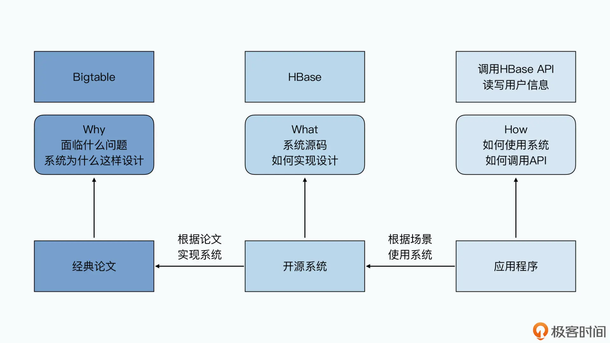
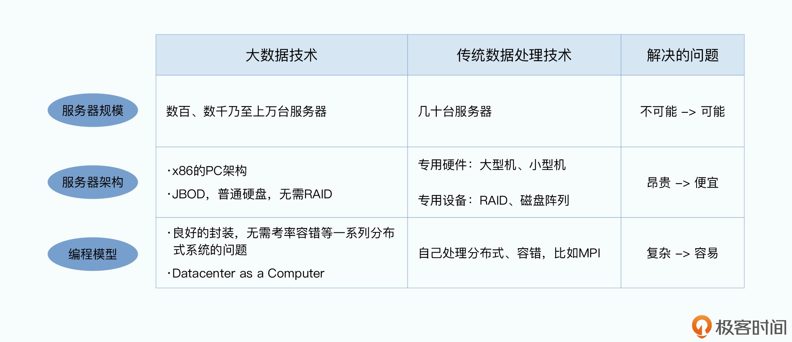
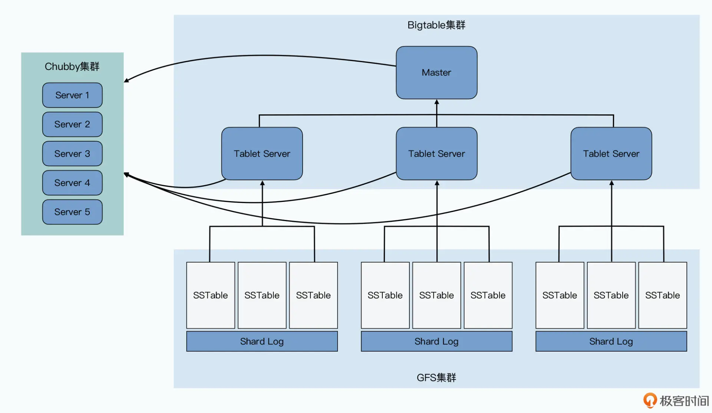

# 课前导读

## 开篇词 ｜ 读论文是成为优秀工程师的成年礼

Q：学习过程中，如何追根溯源，如何深入思考？

A：

## 01 | 什么是大数据：从GFS到Dataflow，12年大数据生态演化图

Q：大数据到底是什么？

Q：大数据特点是什么？

A：**大数据特点（4V）：**

- Volume（大量）

- Velocity（高速）

- Variety（多样）

- Value（低价值密度）

大数据5V特征：数量volume（PB级，记录、日志，在线交易，社交网络），实效性velocity（批处理，实时，数据流，处理速度），真实性veracity（可信性，真伪性，来源&信誉，不完整，可审计性），多样性variety（结构化，非结构化，多源），价值value（算法，密度低，相关性，价值高）。

Q：大数据技术到底是什么？

Q：大数据技术的核心理念是什么？

A：**大数据技术的核心理念**

1. 第一个，是能够伸缩到一千台服务器以上的分布式数据处理集群的技术。大型集群让处理海量数据变得“可能”。
2. 第二个，是这个上千个节点的集群，是采用廉价的 PC 架构搭建起来的。基于开放的 PC 架构，让处理海量数据变得“便宜”。
3. 最后一个，则是“把数据中心当作是一台计算机”（Datacenter as a Computer）。优秀的封装和抽象，让处理海量数据变得“容易”。

Q：大数据技术的三个核心技术理念是从哪里来的？

Q：Google 的三驾马车是什么？针对哪三类问题？技术优缺点是什么？

Q：OLAP 和 OLTP 的区别是什么？

Q：Lambda 架构是什么？Kappa 架构是什么？

## 02 | 学习方法：建立你的大数据知识网络

Q：大数据领域的相关知识，可以分哪三个维度？

Q：分布式系统的三个特性是什么？

Q：CAP 是什么？

Q：Parquet 和 ORCFile 列存储格式的区别是什么？

Q：Snappy 和 LZO 快速压缩算法的区别是什么？还有哪些常见压缩算法？

Q：存储引擎关键的技术点是什么？主要包括哪三个部分？

# 基础知识篇：Google的三驾马车

## 03 | The Google File System （一）： Master的三个身份

Q：GFS 三个重要的设计原则是什么？

Q：Hadoop 如何实现 GFS 的设计思路？有哪些不同？Hadoop 3.x、2.x、1.x多个版本之间的重要区别是什么？

Q：GFS 读数据步骤是什么？Hadoop 读数据流程是什么？

Q：介绍一下 master 的快速恢复型和可用性保障？如何实现 HDFS HA 高可用？

## 04 | The Google File System （二）： 如何应对网络瓶颈？

Q：GFS 数据写入的具体步骤是什么？Hadoop 写数据流程是什么？

Q：LRU 是什么？如何实现 LRU？

Q：面对网络瓶颈，如何解决？

Q：Hadoop 中机架感知是什么？应用在哪里？

## 05 | The Google File System （三）： 多写几次也没关系

Q：GFS 的文件，只能保障“至少一次”的追加写入。那么，如果我们通过 GFS 的客户端要写入一部电影到 GFS，然后过一阵再读出来，我们都可以有哪些方式，来保障这个电影读取之后能够正常播放呢？

## 06 | MapReduce（一）：源起Unix的设计思想

Q：MapReduce 到底是要解决什么样的问题？而要解决这些问题的系统，又应该要怎么设计？

Q：Hadoop 中 MapReduce 工作流程是什么？

Q：Hadoop 中 Shuffle 机制是什么？

Q：MapReduce 是一个典型的模版方法模式，那么设计模式中模版方法模式是什么？

## 07 | MapReduce（二）：不怕失败的计算框架

Q：MapReduce 框架本身需要解决哪三个重要问题？

Q：MapReduce 如何调度执行？Yarn 基本架构是什么？Yarn 工作机制是什么？Hadoop 作业调度器有哪几种？

Q：分片的大小，多少最佳，如何计算？不同版本的Hadoop块默认大小是多少？

Q：Hadoop 1.0实现，和MapReduce论文不一样的地方在哪？这个设计，导致了什么问题？由此Hadoop集群的瓶颈/上限在哪里？

Q：Hadoop 2.0，做了哪些改动，回到和MapReduce论文相同的架构？

Q：MapReduce如何优化网络带宽？

Q：MapReduce处理数据时，数据不平衡，发生数据倾斜，MapReduce论文里给出的解决方法是什么？

## 08 | Bigtable（一）：错失百亿的Friendster

Q：GFS 和 MapReduce解决了什么问题？局限性有哪些？

Q：即使有了 GFS 和 MapReduce，还有什么非常重要的需求没有在大型的分布式系统上得到满足？

Q：Bigtable 想要解决什么问题？我们不能用 MySQL 这样的关系型数据库，搭建一个集群来解决吗？

Q：Bigtable 的架构是怎么样的？它是怎么来解决可用性、一致性以及容易运维这三个目标的？

Q：Bigtable 的底层数据结构是怎么样的？它是通过什么样的方式在机械硬盘上做到高并发地随机读写呢？

Q：社交网络中，用户查看还有发帖，有哪些解决办法？公司的Uki APP是怎么实现的？国内其他大公司是怎么做的？

Q：IOPS是什么？

Q：分库分表的方案，会有哪些问题？

Q：Bigtable就是完美的吗，没有缺陷吗？后续课程中的Spanner又是什么？

Q：同样业务，架构设计不同的公司，又会有什么后果？

Q：对于系统设计，除了真实的场景和需求，需要考虑哪些？

A：所有的架构设计都不是闭门造车，而是来自于真实的场景和真实的需求。而对于系统设计来说，除了业务需求和性能指标之外，有大量的隐性的需求同样重要甚至可能更加重要，Bigtable 特别重视的“可伸缩性”和“可运维性”就是最好的一个例子。

## 09 | Bigtable（二）：不认识“主人”的分布式架构

Q：如何支撑好每秒十万、乃至百万级别的随机读写请求？

Q：如何解决好“可伸缩性”和“可运维性”的问题？在一个上千台服务器的集群上，Bigtable 怎么能够做到自动分片和灾难恢复？

Q：整个 Bigtable 的整体架构和组件由哪些东西组成？

Q：如何理解Bigtable的列族？

Q：Bigtable中本地组是什么？HBase中的HFile是什么？

Q：MySQL中的Shard是什么，Bigtable中的Tablet是什么？那Mongo、Kafka中分区之后的每一片数据对应是什么？

Q：Bigtable由哪4个组件组成？

A：整个 Bigtable 是由 4 个组件组成的，分别是：

- 负责存储数据的 GFS；

- 负责作为分布式锁和目录服务的 Chubby；

- 负责实际提供在线服务的 Tablet Server；

- 负责调度 Tablet 和调整负载的 Master。

Q：单个 Tablet 的底层存储和读写，具体是如何实现来做到高性能的？

Q：Chubby 到底是什么？

Q：Bigtable 论文里的第 7 部分“性能评估”里，你可以看到 Bigtable 在随机读数据上的性能表现并不好，无法真正做到随着节点数的增加线性增长。这是为什么呢？

## 10 | Bigtable（三）：SSTable存储引擎详解

Q：Bigtable 本身的单个 Tablet 是如何提供服务的？

Q：我们如何利用好硬件特性，以及合理的算法和数据结构，让单个 Tablet 提供足够强劲的性能？

Q：如何提供高性能的随机数据写入？

Q：Bigtable 是一个支持随机读写的 KV 数据库，而且它实际的数据存储是放在 GFS 上的。这两点，听起来似乎是自相矛盾的，为什么一个对随机读写没有一致性保障的文件系统，可以拿来作为主要用途是随机读写的数据库的存储系统呢？

Q：Minor Compaction 机制是什么？

Q：如何利用局部性原理？

Q：MemTable 的数据结构是什么？AVL红黑树是什么？跳表是什么？SSTable 的文件格式是什么？

Q：布隆过滤器本质是什么？

A：布隆过滤器本质是一个二进制向量。

## 11 | 通过Thrift序列化：我们要预知未来才能向后兼容吗？

Q：Thrift、Protobuf、gRPC的区别？

Q：二进制序列化，只是为了减少存储所占的空间吗，比如Java的序列化？

Q：Thrift 里的 TBinaryProtocol 的实现方式是什么？

Q：Delta Encoding是什么？

Q：ZigZag+VQL 的编码方式是什么？
